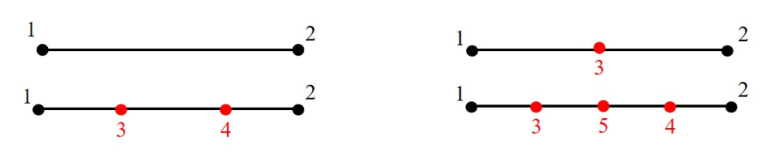
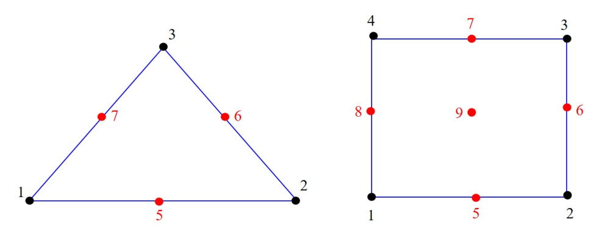
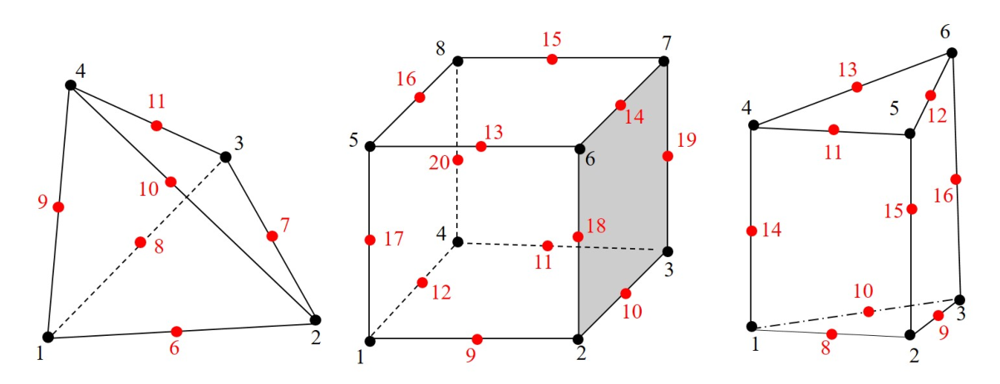
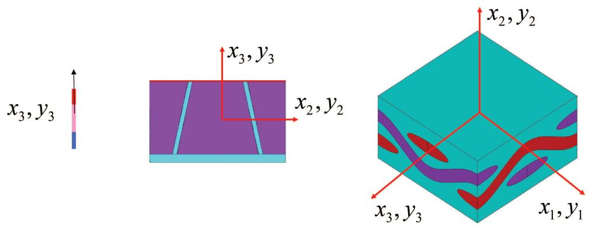
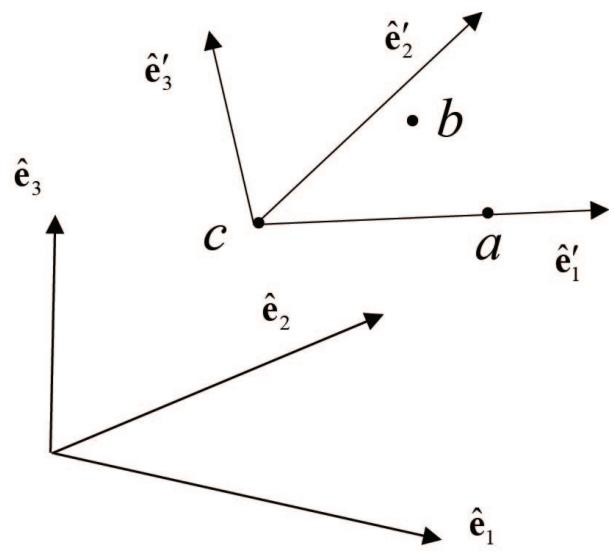

# Conventions

To understand the inputs and interpret outputs of the program correctly, we need to explain some conventions used in SwiftComp.

## Elements

SwiftComp meshes 1D SGs using two-node, three-node, four-node, or five-node elements for as shown in .
Nodes 3, 4, 5 are optional and one or more of these nodes can be missing for a valid 1D element.
It is recommended to use 2-node elements for 3D structures with a 1D SG (see Figure 3a) and 5-node elements for 2D plate/shell models with a 1D SG (see Figure 5a). 

:::{figure-md} fig-1d-element-nodal-numbering

1D element nodal numbering.
:::

SwiftComp meshes 2D SGs using either triangular or quadrilateral elements as shown in Figure 9.
It is also shown in the figure that SwiftComp numbers the nodes of each 2D elements in the counterclockwise direction.
Nodes 1, 2, and 3 of the triangular elements and nodes 1, 2, 3, and 4 of the quadrilateral elements are at the corners.
For triangular element, the fourth node is zero to inform SwiftComp that it is a triangular element.
Nodes 5, 6, 7 of the triangular elements and nodes 5, 6, 7, 8, 9 of quadrilateral elements are optional.
Any one or more of these nodes can be missing for a valid 2D element. 

:::{figure-md} fig-2d-element-nodal-numbering

2D element nodal numbering.
:::

SwiftComp meshes 3D SGs using tetrahedral elements, brick elements, or wedge elements as shown in Figure 10.
For tetrahedral elements, the fifth node is zero to inform SwiftComp that it is a tetrahedral element.
For wedge elements, the seventh node is zero to inform SwiftComp that it is a wedge element.
The nodes other than the corners are optional.
Any one or more of these nodes can be missing for a valid 3D element.

:::{figure-md} fig-3d-element-nodal-numbering

3D element nodal numbering.
:::

## Local Coordinate System, Elemental Coordinate System, and Material Coordinate System

First, SwiftComp uses a right-hand Cartesian coordinate system, also called the *local coordinate system*, denoted as $y_1$, $y_2$ and $y_3$, to describe a 3D SG, $y_{2}$ and $y_{3}$ to describe a 2D SG, and $y_{3}$ to describe a 1D SG (see Figure 11).
$y_{1}$, $y_{2}$, and $y_{3}$ are parallel to the *global coordinates* $x_{1}$, $x_{2}$, and $x_{3}$, respectively.
The global coordinates $x_{1}$, $x_{2}$, and $x_{3}$ are used to describe the original structure and the macroscopic structure.
Note that if the material properties are provided in a coordinate system different from $y_{1}$, $y_{2}$, $y_{3}$, an additional coordinate system called the *material coordinate system* should be defined and a transformation of the material properties from the material coordinate system into those expressed in the local coordinate system is automatically carried out by SwiftComp.

:::{figure-md} fig-local-coordinate-system

Local coordinate system describing SG.
:::

In SwiftComp, an elemental coordinate system $y_{i}^{\prime}$ can be defined for each element denoted by three points $a$, $b$, $c$, with the line from point $c$ to point $a$ denoting $y_{1}^{\prime}$ direction and the line from point $c$ to point $b$ denoting a line located in the $y_{1}^{\prime}$-$y_{2}^{\prime}$ plane; see Figure 12 for a sketch.
Speaking in the language of vectors, the new coordinate system is defined by three points with position vectors in the local coordinate system ( $y_{i}$ with $\hat{\mathbf{e}}_{i}$ as the unit vectors) by $\mathbf{a}$, $\mathbf{b}$, and $\mathbf{c}$.
$\mathbf{a}-\mathbf{c}$ denotes $\hat{\mathbf{e}}_{1}^{\prime}$, $\mathbf{b}-\mathbf{c}$ is a vector in the $y_{1}^{\prime}$-$y_{2}^{\prime}$ plane.
With this information, one can compute the direction cosine matrix relating $y_{i}$ to $y_{i}^{\prime}$ according to the following steps: 

- Obtain $\hat{\mathbf{e}}_{1}^{\prime}$ through normalization of $\mathbf{a} - \mathbf{c}$: $\hat{\mathbf{e}}_{1}^{\prime} = \frac{\mathbf{a}-\mathbf{c}}{|\mathbf{a}-\mathbf{c}|}$;
- Obtain $\hat{\mathbf{e}}_{3}^{\prime}$ through normalization of the cross product of $\hat{\mathbf{e}}_{1}^{\prime}$ and $\mathbf{b}-\mathbf{c}$: $\hat{\mathbf{e}}_{3}^{\prime} = \frac{\hat{\mathbf{e}}_{1}^{\prime} \times (\mathbf{b} - \mathbf{c})}{|\hat{\mathbf{e}}_{1}^{\prime} \times (\mathbf{b} - \mathbf{c})|}$;
- Obtain $\hat{\mathbf{e}}_{2}^{\prime}$ through the cross product of $\hat{\mathbf{e}}_{3}^{\prime}$ and $\hat{\mathbf{e}}_{1}^{\prime}$: $\hat{\mathbf{e}}_{2}^{\prime} = \hat{\mathbf{e}}_{3}^{\prime} \times \hat{\mathbf{e}}_{1}^{\prime}$

:::{figure-md} fig-elemental-coordinate-system

Elemental coordinate system defined by three points.
:::

SwiftComp allows the user to define the material properties in the local coordinate system $y_{i}$ or in the material coordinate system.
The material coordinate system could be the elemental coordinate system or a coordinate system defined in such a way that it can be obtained by a simple rotation about $y_{3}^{\prime}$ of the elemental coordinate system.
Clearly for composite laminates, this simple rotation corresponds to the layup angle. 

## Constituent Constitutive Models

Generally speaking, the constituents contained in a SG could be responsive to thermal, mechanical, electric, and magnetic fields. If these effects are not coupled, the linear elastic behavior can be modeled using the Hooke’s law in Eq. (3). 

To deal with uncoupled thermal, electric, and magnetic effects, conduction can be modeled using the following constitutive relation: 

$$
\left\{ \begin{array}{l} q _ {1} \\ q _ {2} \\ q _ {3} \end{array} \right\} = - \left[ \begin{array}{c c c} k _ {1 1} & k _ {1 2} & k _ {1 3} \\ k _ {1 2} & k _ {2 2} & k _ {2 3} \\ k _ {1 3} & k _ {2 3} & k _ {3 3} \end{array} \right] \left\{ \begin{array}{l} T _ {, 1} \\ T _ {, 2} \\ T _ {, 3} \end{array} \right\}
$$

where $q _ { i }$ is the heat flux, $k _ { i j }$ is the conductivity, and $T _ { , i }$ is the gradient of the temperature $T$ .
Since conduction is mathematically analogous to electrostatics, magnetostatics, and diffusion, SwiftComp can also be used to predict effective dielectric, magnetic, and diffusive properties of composite materials and the corresponding local fields.
For example, to obtain the effective dielectric properties, we just need to let $q _ { i }$ denote the electric displacements, $T$ denote the electric potential, and $k _ { i j }$ denote the corresponding dielectric properties. 

For coupled mutliphysics modeling, we will have piezoelectric and piezomagnetic effects as well as pyroelectric, pyromagnetic, and electromagnetic effects.
For linear behavior among all these fields, the constitutive equations can be expressed as: 

$$
\begin{aligned}
\sigma_ {i j} &= C _ {i j k l} \varepsilon_ {k l} - e _ {k i j} E _ {k} - q _ {k i j} H _ {k} + \Lambda_ {i j} \theta \\
D _ {i} &= e _ {i k l} \varepsilon_ {k l} + k _ {i k} E _ {k} + a _ {i k} H _ {k} + p _ {i} \theta \\
B _ {i} &= q _ {i k l} \varepsilon_ {k l} + a _ {i k} E _ {k} + \mu_ {i k} H _ {k} + m _ {i} \theta
\end{aligned}
$$

where $C _ { i j k l }$ , $e _ { k i j }$ , $q_{kij}$ , and $\Lambda _ { i j }$ are the elastic, the piezoelectric, the piezomagnetic, and the thermal stress tensors, respectively (note that $\Lambda _ { i j } = - C _ { i j k l } \alpha _ { k l }$ with $\alpha _ { k l }$ as the thermal expansion tensor); $\sigma _ { i j }$ and $\varepsilon _ { i j }$ are the stress tensor and strain tensor, respectively; $k _ { i k }$ , $a _ { i k }$ , and $\mu _ { i k }$ are the dielectric, electromagnetic, and magnetic permeability tensors, respectively; and $p _ { i }$ and $m _ { i }$ are the pyroelectric and pyromagnetic vectors, and $D _ { i }$ , $E _ { k }$ , $B _ { i }$ , and $H _ { k }$ are the electric displacement, electric field, magnetic induction, and magnetic field vectors, respectively.
$\theta$ denotes the difference between the actual temperature and the reference temperature.
SwiftComp does not restrict $\theta$ to be small.
If $\theta$ is not small, $\Lambda _ { i j } , p _ { i } , m _ { i }$ are not the tangent or instantaneous properties, but the secant properties which are defined as average over a change of temperature.
For example, let $\alpha _ { t } ( T )$ denote the tangent or instantaneous coefficient of thermal expansion (CTE), the secant CTE is defined as 

$$
\alpha (T) = \frac {1}{T - T _ {1}} \int_ {T _ {1}} ^ {T} \alpha_ {t} (\zeta) d \zeta = \frac {1}{\theta} \int_ {T _ {1}} ^ {T _ {1} + \theta} \alpha_ {t} (\zeta) d \zeta
$$

with $T _ { 1 }$ as the reference temperature and $\theta = T - T _ { 1 }$ . For convenience, SwiftComp uses tangent or instantaneous properties for $\alpha _ { i j } , p _ { i } , m _ { i }$ as inputs and computes the secant properties internally for constitutive modeling of temperature dependent properties. 

Linear multiphysics behavior is modeled based on the following energy functional corresponding to the constitutive equation: 

$$
U = \frac {1}{2} \epsilon^ {T} L \epsilon + \epsilon^ {T} \beta \theta - \int_ {T _ {1}} ^ {T} \int_ {T _ {1}} ^ {\zeta} \frac {c _ {v} (0 , \rho)}{\rho} d \rho d \zeta
$$

where 

$$
\epsilon = \left\lfloor \varepsilon_{11} \quad \varepsilon_{22} \quad \varepsilon_{33} \quad 2\varepsilon_{23} \quad 2\varepsilon_{13} \quad 2\varepsilon_{12} \quad -E_{1} \quad -E_{2} \quad -E_{3} \quad -H_{1} \quad -H_{2} \quad -H_{3} \right\rfloor^{T}
$$

is a multiphysical field array containing the 3D strain field $\varepsilon_{ij}$ , the 3D electric field $E_{i}$ , and the 3D magnetic field $H_{i}$ .
The conjugate multiphysical field array $\sigma$ can be expressed as 

$$
\sigma = \left\lfloor \sigma_{11} \quad \sigma_{22} \quad \sigma_{33} \quad \sigma_{23} \quad \sigma_{13} \quad \sigma_{12} \quad D_{1} \quad D_{2} \quad D_{3} \quad B_{1} \quad B_{2} \quad B_{3} \right\rfloor^ {T}
$$

$L$ is a $12 \times 12$ multiphysics matrix containing all the necessary material constants for characterizing fully coupled thermoelectromagnetoelastic materials such that 

$$
L = \begin{bmatrix}
 C & e & q \\
 e^{T} & -k & -a \\
 q^{T} & -a^{T} & -\mu
\end{bmatrix}
$$

where $C$ is a $6 \times 6$ submatrix for elastic constants, $e$ is a $6 \times 3$ submatrix for piezoelectric coefficients, $q$ is a $6 \times 3$ submatrix for piezomagnetic coefficients, $k$ is a $3 \times 3$ submatrix for dielectric coefficients, $a$ is a $3 \times 3$ submatrix for electromagnetic coefficients, and $\mu$ is a $3 \times 3$ submatrix for magnetic permeability.
Note $C , k , \mu , a$ are symmetric matrices.
The explicit form of the $12 \times 12$ matrix is as follows 

$$
\begin{bmatrix}
C_{11} & C_{12} & C_{13} & C_{14} & C_{15} & C_{16} & e_{11} & e_{21} & e_{31} & q_{11} & q_{21} & q_{31} \\
C_{12} & C_{22} & C_{23} & C_{24} & C_{25} & C_{26} & e_{12} & e_{22} & e_{32} & q_{12} & q_{22} & q_{32} \\ 
C_{13} & C_{23} & C_{33} & C_{34} & C_{35} & C_{36} & e_{13} & e_{23} & e_{33} & q_{13} & q_{23} & q_{33} \\
C_{14} & C_{24} & C_{34} & C_{44} & C_{45} & C_{46} & e_{14} & e_{24} & e_{34} & q_{14} & q_{24} & q_{34} \\ 
C_{15} & C_{25} & C_{35} & C_{45} & C_{55} & C_{56} & e_{15} & e_{25} & e_{35} & q_{15} & q_{25} & q_{35} \\
C_{16} & C_{26} & C_{36} & C_{46} & C_{56} & C_{66} & e_{16} & e_{26} & e_{36} & q_{16} & q_{26} & q_{36} \\ 
e_{11} & e_{12} & e_{13} & e_{14} & e_{15} & e_{16} & -k_{11} & -k_{12} & -k_{13} & -a_{11} & -a_{12} & -a_{13} \\
e_{21} & e_{22} & e_{23} & e_{24} & e_{25} & e_{26} & -k_{12} & -k_{22} & -k_{23} & -a_{12} & -a_{22} & -a_{23} \\
e_{31} & e_{32} & e_{33} & e_{34} & e_{35} & e_{36} & -k_{13} & -k_{23} & -k_{33} & -a_{13} & -a_{23} & -a_{33} \\
q_{11} & q_{12} & q_{13} & q_{14} & q_{15} & q_{16} & -a_{11} & -a_{21} & -a_{31} & -\mu_{11} & -\mu_{12} & - \mu_ {1 3} \\
q_{21} & q_{22} & q_{23} & q_{24} & q_{25} & q_{26} & -a_{12} & -a_{22} & -a_{32} & -\mu_{12} & -\mu_{22} & - \mu_ {2 3} \\
q_{31} & q_{32} & q_{33} & q_{34} & q_{35} & q_{36} & -a_{13} & -a_{23} & -a_{33} & -\mu_{13} & -\mu_{23} & - \mu_ {3 3}
\end{bmatrix}
$$

Other terms in Eq. (28) include $\beta$ , which is a $1 2 \times 1$ matrix containing the second-order thermal stress tensor $\Lambda _ { i j }$ , the vector of pyroelectric $p _ { i }$ , and the vector of pyromagnetic $m _ { i }$ expressed as 

$$
\beta = \left\lfloor \Lambda_ {1 1} \quad \Lambda_ {2 2} \quad \Lambda_ {3 3} \quad \Lambda_ {2 3} \quad \Lambda_ {1 3} \quad \Lambda_ {1 2} \quad p _ {1} \quad p _ {2} \quad p _ {3} \quad m _ {1} \quad m _ {2} \quad m _ {3} \right\rfloor^ {T}
$$

The coefficient in the last term $c_{v}$ is the specific heat per unit volume at constant strain.
Note in the input, we actually input CTE $\alpha_{kl}$ to be consistent with what has been normally used in thermoelastic analyses.
The code automatically computes $\Lambda_{ij}$ according to the following formula: 

$$
\begin{Bmatrix}
\Lambda_{11} \\ \Lambda_{22} \\ \Lambda_{33} \\ \Lambda_{23} \\ \Lambda_{13} \\ \Lambda_{12}
\end{Bmatrix} =
- \begin{bmatrix}
C_{11} & C_{12} & C_{13} & C_{14} & C_{15} & C_{16} \\
C_{12} & C_{22} & C_{23} & C_{24} & C_{25} & C_{26} \\
C_{13} & C_{23} & C_{33} & C_{34} & C_{35} & C_{36} \\
C_{14} & C_{24} & C_{34} & C_{44} & C_{45} & C_{46} \\
C_{15} & C_{25} & C_{35} & C_{45} & C_{55} & C_{56} \\
C_{16} & C_{26} & C_{36} & C_{46} & C_{56} & C_{66}
\end{bmatrix}
\begin{Bmatrix}
\alpha_{11} \\ \alpha_{22} \\ \alpha_{33} \\ 2\alpha_{23} \\ 2\alpha_{13} \\ 2\alpha_{12}
\end{Bmatrix}
$$

Note in the right hand side, the off-diagonal CTEs are multiplied by 2 so that we have $2 \alpha _ { 1 2 }$ , $2 \alpha _ { 1 3 }$ , $2 \alpha _ { 2 3 }$ according to the engineering notation. 

## Unit Systems

As it is a constant confusion among users regarding the units used in the multiphysics modeling, we will provide a detailed description of those units.
According to the International Standard unit system, we use
- Pa (i.e., $\mathbf {N/m^{2}}$ ) for the elastic constants $C_{ijkl}$ and the stress field $\sigma_{ij}$ (note the strain field $\varepsilon_{ij}$ is unitless),
- $\mathbf{C/m^{2}}$ for piezoelectric constants $e_{ijk}$ and electric displacement $D_{i}$ ,
- $\mathbf { N } / ( \mathbf { A } { \cdot } \mathbf { m } )$ for piezomagnetic constants $q _ { i j k }$ and magnetic induction $B _ { i }$ ,
- $\mathbf { C } / ( \mathbf { V } { \cdot } \mathbf { m } )$ for dielectric constants $k _ { i j }$ ,
- $\mathbf { N } / \mathbf { A } ^ { 2 }$ (or $\mathbf { N } { \cdot } \mathbf { s } ^ { 2 } / \mathbf { C } ^ { 2 }$ ) for magnetic permeability $\mu _ { i j }$ ,
- $\mathbf { C } / ( \mathbf { A } { \cdot } \mathbf { m } )$ for electromagnetic coefficients $a _ { i j }$ ,
- $\mathbf { V } / \mathbf { m }$ for electric field $E _ { i }$ ,
- $\mathbf { A } / \mathbf { m }$ for magnetic field $H _ { i }$ ,
- $\mathbf { K }$ for the temperature field $\theta$ (note $^ \circ \mathbf { C }$ has the same unit dimension as $\mathbf { K }$ ),
- $\mathbf { 1 } / \mathbf { K }$ for CTE $\alpha _ { i j }$ (correspondingly $\mathbf { P a } / \mathbf { K }$ for thermal stress coefficients $\Lambda _ { i j }$ ),
- $\mathbf { C } / \mathbf { m } ^ { 2 } { \cdot } \mathbf { K }$ for pyroelectric constants $p _ { i }$ ,
- $\mathbf { N } / ( \mathbf { A } { \cdot } \mathbf { m } { \cdot } \mathbf { K } )$ for pyromagnetic $m _ { i }$ , and
- $\mathbf { J } / ( \mathbf { m } ^ { 3 } { \cdot } \mathbf { K } )$ for the specific heat .

With all these units, the energy density $U$ will be in the $c _ { v }$ unit of $\mathbf { N } / \mathbf { m } ^ { 2 }$ , which is the same as $\mathbf { J } / \mathbf { m } ^ { 3 }$ .
Note N=C·V/m and J=N·m. 

Although the units aforementioned are consistent with each other, direct use of these units will introduce an extremely ill-conditioned material matrix $L$ as for regular materials, we have $C _ { i j k l }$ in the order of $1 0 ^ { 1 1 }$ , while $k _ { i j }$ in the order of $1 0 ^ { - 9 }$ .
Proper scaling is needed even if double precision is used in computing.
To this end, we define $\begin{array} { r } { E _ { i } ^ { * } = \frac { E _ { i } } { 1 0 ^ { 9 } } , H _ { i } ^ { * } = \frac { H _ { i } } { 1 0 ^ { 9 } } } \end{array}$ , then the energy density can be rewritten as: 

$$
\frac {U}{1 0 ^ {9}} = \frac {1}{2} \left\{ \begin{array}{l} \varepsilon \\ - E ^ {*} \\ - H ^ {*} \end{array} \right\} ^ {T} \left[ \begin{array}{c c c} C ^ {*} & e & q \\ e ^ {T} & - k ^ {*} & - a ^ {*} \\ q ^ {T} & - a ^ {* T} & - \mu^ {*} \end{array} \right] \left\{ \begin{array}{l} \varepsilon \\ - E ^ {*} \\ - H ^ {*} \end{array} \right\} + \left\{ \begin{array}{c} \varepsilon \\ - E ^ {*} \\ - H ^ {*} \end{array} \right\} ^ {T} \left\{ \begin{array}{c} - C ^ {*} \alpha \\ p \\ m \end{array} \right\} \theta - \int_ {T _ {1}} ^ {T} \int_ {T _ {1}} ^ {\zeta} \frac {c _ {v} ^ {*} (0 , \rho)}{\rho} d \rho d \zeta
$$

with 

$$
C ^ {*} = \frac {C}{1 0 ^ {9}}, \quad c _ {v} ^ {*} = \frac {c _ {v}}{1 0 ^ {9}}, \quad k ^ {*} = k \times 1 0 ^ {9}, \quad a ^ {*} = a \times 1 0 ^ {9}, \quad \mu^ {*} = \mu \times 1 0 ^ {9}
$$

The generalized Hooke’s law given in Eq. (26) can be rewritten in the following matrix form: 

$$
\begin{aligned}
\sigma^ {*} &= C ^ {*} \varepsilon - e E ^ {*} - q H ^ {*} + \Lambda^ {*} \theta \\
D &= e ^ {T} \varepsilon + k ^ {*} E ^ {*} + a ^ {*} H ^ {*} + p \theta \\
B &= q ^ {T} \varepsilon + a ^ {* T} E ^ {*} + \mu^ {*} H ^ {*} + m \theta
\end{aligned}
$$

with $\begin{array} { r } { \sigma ^ { * } = \frac { \sigma } { 1 0 ^ { 9 } } } \end{array}$ .
For SwiftComp to perform multiphysics homogenization, we input $C ^ { \ast } , c _ { v } ^ { \ast } , e , q , k ^ { \ast }$ $a ^ { * } , \mu ^ { * } , \alpha , p , m$ as material properties, and for SwiftComp to perform multiphysics dehomogenization, we input $\varepsilon , E ^ { * } , H ^ { * }$ as the global fields.
In other words, if the quantities are given in IS units, we need to divide $C , c _ { v } , E , H$ by $1 0 ^ { 9 }$ , and multiply $k , a , \mu$ by $1 0 ^ { 9 }$ , and all the other quantities remain the same.
The output effective properties are also scaled the same way as the input material properties.
As far as the local fields out of dehomogenization are concerned, the mechanical displacement, strains, electric displacements, and magnetic induction are the same as SI units, however one needs to multiply the electromagnetic potential, the stresses, electric and magnetic fields with $1 0 ^ { 9 }$ to convert these quantities in SI units.
Note, it is just one suggestion for users to scale SwiftComp inputs to avoid numerical difficulties. This scaling is done externally by the end user of the code.
One can certainly devise a different scaling following the same idea given here. 
