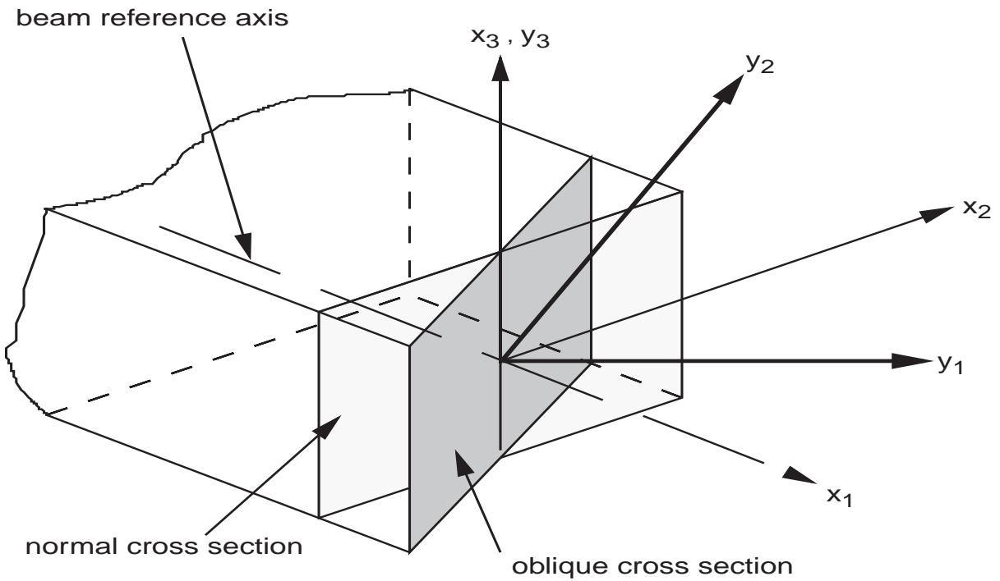

# Homogenization

Although general-purpose preprocessors can been developed to prepare SwiftComp input files, it is still beneficial for advanced users, particularly those who want to embed SwiftComp in their own software environments, to understand the meaning of the input data. 

## Extra Inputs for Dimensionally Reducible Structures

To construct a beam/plate/shell model, the beginning of the input file has two extra lines for a plate/shell model, and three extra lines for a beam model.

### Beam Model

```
  model
    k11     k12    k13
 cos_11  cos_21
```

:`model`:
    Integer.
    Beam model.
    - 0: Classical model (Euler-Bernoulli beam model)
    - 1: Shear refined model (Timoshenko beam model)
    - 2: Vlasov beam model
    - 3: Beam model with the trapeze effect

:`k11`, `k12`, `k13`:
    Real numbers.
    Initial twist/curvatures of the structure.
    If the structure is initially straight, zeroes should be provided instead.

:`cos_11`, `cos_21`:
    Real numbers.
    Oblique cross-section, see figure below for a sketch of such a cross-section.
    - `cos_11`: Cosine of the angle between normal of the oblique section ($y_1$) and beam axis $x_{1}$.
    - `cos_21`: Cosine of the angle between $y_{2}$ of the oblique section and beam axis ($x_{1}$).
    The summation of the square of these two numbers should not be greater than 1.0 in double precision.
    The inputs including coordinates, material properties, etc. and the outputs including mass matrix, stiffness matrix, etc. are given in the oblique system, the $y_{i}$ coordinate system as shown in figure below.
    For normal cross-sections, we provide `1.0  0.0` on this line instead.

:::{figure-md} fig-oblique-cross-section


Sketch of an oblique reference cross-section.
:::


### Plate/Shell Model

```
  model
    k12    k21
```

:`model`:
    Integer. Plate/shell model.
    - 0, it will construct a classical model (Kirchhoff-Love plate/shell model).
    - 1, it will construct a shear refined model (Reissner-Mindlin plate/shell model).

:`k12`, `k21`:
    Real numbers. Initial twist/curvatures of the structure.
    If the structure is initially straight, zeroes should be provided instead.


```{note}
To construct a 3D structural model, the previous three lines do not exist and the input file starts from this line.
```

## Inputs for All Structural Models

### Control parameters


The first line of this block has four integers providing the problem control parameters as: 

```
analysis  elem_flag  trans_flag  temp_flag 
```

:`analysis`:
    Integer.
    Analysis type.
    - 0: elastic
    - 1: thermoelastic
    - 2: conduction
    - 3: piezoeletric/piezomagnetic
    - 4: thermopiezoeletric/thermopiezomagnetic
    - 5: piezoeletromagnetic
    - 6: thermopiezoeletromagnetic
    - 7: viscoelastic
    - 8: thermoviscoelastic
    - 9: homogenization to 8-node 3D element
    - 10: homogenization to 20-node 3D element

    ```{note}
    It is pointed out here that piezoelectric effects are mathematically equivalent to piezomagnetic effects.
    In other words, the same equation or code used for modeling piezoelectric materials can be used to model piezomagnetic materials if we replace electric displacement $D_{i}$ with magnetic induction $B_{i}$, electric field $E_{i}$ with magnetic field $H_{i}$, piezoelectric properties $e_{kij}$ with piezomagnetic properties $q_{kij}$, pyroelectric properties $p_{i}$ with pyromagnetic properties $m_{i}$ .
    Later, for `analysis`=3 or 4, in the inputs we used piezoelectric materials as example.
    It is directly applicable to piezomagnetic materials.
    ```

:`elem_flag`:
    Integer.
    Element type.
    - 0: Regular elements as shown in Figures 8, 9, 10 will be used for 1D, 2D or 3D SGs
    - 1: Elements with one dimension degenerated will be used to model the SG. For example, 2D shell elements based on relative degrees of freedom will be used to mesh a 3D SG or 1D elements will be used to mesh a 2D SG.
    - 2: 1D elements will be used to mesh a 3D SG. For example, 1D beam elements can be used to model a 3D SG composed of slender truss-like members.

    ```{note}
    Currently only regular elements are implemented.
    ```

:`trans_flag`:
    Integer.
    Whether transformation of the element orientation is needed.
    - 0: Element orientation is the same as the problem coordinate system and transformation is not needed.
    - 1: Elemental coordinate systems are defined for each element and elemental orientations will be provided in a later block for the transformation.

:`temp_flag`:
    Integer.
    Whether the temperature is uniform within the SG.
    For thermally coupled analysis (`analysis` is 1, 4, or 6)
    - 0: Temperature distribution within SG is uniform.
    - 1: Temperature distribution is not uniform and nodal temperature should be provided to describe the temperature field.
    For other analyses, this entry can be arbitrary.


If `analysis` is 7 or 8 (viscoelastic related), the next line will list three real numbers arranged as: 

```
t_0  t_e  dt 
```

:`t_0`:
    Real.
    Starting time.

:`t_e`:
    Real.
    Ending time.

:`dt`:
    Real.
    Increment of time.

```{note}
In the current version we follow the conventional practice of thermoviscoelastic analysis.
The real time ranges from $10^{t_{0}}$ to $10^{t_{e}}$ with time increment of $10^{dt}$.
The code will compute time-dependent effective properties at $10^{t_{0}}, 10^{t_0+dt}, \ldots, 10^{t_{e}}$. 
```

If the SG is aperiodic or partially periodic, the next line will list three integers arranged as: 

```
py1  py2  py3 
```

:`py1`, `py2`, `py3`:
    Integer.
    Periodicity along $y_1$, $y_2$, $y_3$ directions, respectively.
    - 0: Periodic
    - 1: Aperiodic

    For example, for a 3D SG which is aperiodic along $y_2$ direction, we will have `0 1 0`

    ```{note}
    For the 2D plate/shell model, only $y_1$ or $y_2$ can be periodic or aperiodic.
    For the 1D beam model, only $y_1$ can be periodic or aperiodic.
    ```

The next line lists six integers arranged as: 

```
nsg  nnode  nelem  nmate  nslave  nlayer  nsurf_nodes 
```

:`nsg`:
    Integer.
    Dimensionality of the SG: 1, 2, or 3.

:`nnode`:
    Integer.
    Total number of nodes.

:`nelem`:
    Integer.
    Total number of elements.

:`nmate`:
    Integer.
    Total number of materials.

:`nslave`:
    Integer.
    Number of slave nodes on periodic boundaries for periodic microstructures.

    If `nslave` is 0, SwiftComp will search for corresponding node on periodic boundaries.
    For this reason, the SG must be regular rectangles (for 2D SG) or cuboids (for 3D SG) with the FE mesh having corresponding nodes on periodic edges or faces.
    For other periodic SG shapes, the paired nodes on corresponding boundaries must be provided through setting `nslave` not equal to zero. 

:`nlayer`:
    Integer.
    Total number of layers defined by different types of materials and layup angle.

:`nsurf_nodes`:
    Integer.
    Total number of nodes for the outside surfaces of the SG.

    For the current version, this is only implemented for `analysis` is 9 or 10.


### Mesh

The next `nnode` lines are the coordinates for each node arranged as: 

```
node_no  [[y1]  y2]  y3 
```

:`node_no`:
    Integer.
    Unique number assigned to each node.

:`y1`, `y2`, `y3`:
    Real.
    Nodal coordinates.

    Only `y3` is needed for 1D SGs, and `y2` and `y3` are needed for 2D SGs. 

```{note}
Arrangement of `node_no` is not necessary to be consecutive, but all nodes from 1 to `nnode` should be present.
```

The next `nelem` lines list the layer number and nodes for each element.
They are arranged as:

```
elem_no  mate_id|layer_id  node_1  node_2 ...
```

:`elem_no`:
    Integer.
    Unique number assigned to each element.

:`mate_id|layer_id`:
    Integer.
    Material ID assigned to the element.
    If `nlayer` is not 0, then `mate_id` should be replaced with `layer_id` which will be defined later.

:`node_1`, `node_2`, ...:
    Integer.
    Nodes belonging to this element.

    If the SG is meshed using regular elements (e.g., elements having the same dimension as the SG), 
    - 1D elements could have up to 5 nodes. If a node is not present in the element, the value is 0; see Figure 8.
    - 2D elements could have up to 9 nodes. If a node is not present in the element, the value is 0. If the fourth node is zero, it is a triangular element; see Figure 9.
    - 3D elements could have up to 20 nodes. If a node is not present in the element, the value is 0. If the fifth node is zero, it is a tetrahedral element; If the fifth node is not zero, but the seventh node is zero, it is a wedge element; see Figure 10.

```{note}
Arrangement of `elem_no` is not necessary to be consecutive, but all elements starting from 1 to `nelem` should be present.
```

If `trans_flag` is 1, the next `nelem` lines list the orientation for each element.
They are arranged as 

```
elem_no  a1  a2  a3  b1  b2  b3  c1  c2  c3 
```

:`elem_no`:
    Integer.
    Element ID.

:`a1`, `a2`, `a3`:
    Real.
    Coordinates of point $a$.

:`b1`, `b2`, `b3`:
    Real.
    Coordinates of point $b$.

:`c1`, `c2`, `c3`:
    Real.
    Coordinates of point $c$.

The local coordinate system for the element is defined by the three points $a$, $b$, $c$ as described previously.

```{note}
Arrangement of `elem_no` is not necessary to be consecutive, but all elements starting from 1 to `nelem` should be present.
```

If `temp_flag` is 1, the temperature distribution within the SG is not uniform, the next `nnode` lines list the corresponding nodal temperature.
They are arranged as: 

```
node_no  T 
```

:`node_no`:
    Integer.
    Nodal ID.

:`T`:
    Real.
    Nodal temperature.


If `analysis` is 9, the next line lists the nodes of the macroscopic 3D 8-node element.
They are arranged as: 

```
node_1  node_2  node_3  ...  node_8 
```

where they correspond to the eight nodes of the macroscopic 3D 8-node element numbered in the same order as those in Figure 10. 

If `analysis` is 10, the next line lists the nodes of the macroscopic 3D 20-node element.
They are arranged as: 

```
node_1  node_2  node_3  ...  node_20 
```

where they correspond to the 20 nodes of the macroscopic 3D 20-node element numbered in the same order as those in Figure 10. 

If `analysis` is 9 or 10, the next one or more lines list the nodes on the surfaces.
The total number of surface nodes is `nsurf_nodes`.
No specific format is needed. 

If `nslave` is not 0, the next `nslave` lines list the slave nodes and corresponding master nodes periodic to the slave nodes.
They are arranged as: 

```
slave_node_id  master_node_id 
```

If `nlayer` is not 0, the next `nlayer` lines list the definition for each layer.
They are arranged as: 

```
layer_id  mate_id  angle 
```

:`layer_id`:
    Integer.
    Layer type ID.

:`mate_id`:
    Integer.
    Material ID.

:`angle`:
    Real.
    Extra rotation in degree around local out-of-plane direction.
    Usually used to specify fiber angles.


### Materials

[materials](materials.md)


### Omega volume

Last line:

```
omega
```

Real.
The volume of the domain spanned by the remaining coordinates in the macroscopic structural model.
For 3D structural models, `omega` will be the volume of the homogenized material including both the volume of the material and the volume of possible voids in the SG.
`omega` can be computed by any mesh generator.
For regular SG such as cubes, it can be easily calculated by hand.
For 1D SGs, the volume is the length and for 2D SGs, the volume is the area.
For plate/shell models, `omega` will be the area spanned by $y _ { 1 }$ and $_ { y 2 }$ for 3D SGs, the length along $y _ { 2 }$ for 2D SGs and 1.0 for 1D SGs.
For beam models, `omega` will be the length along $y _ { 1 }$ for 3D SGs and 1.0 for 2D SGs. 


---

Till now, we have prepared all the inputs necessary for the homogenization run. 
