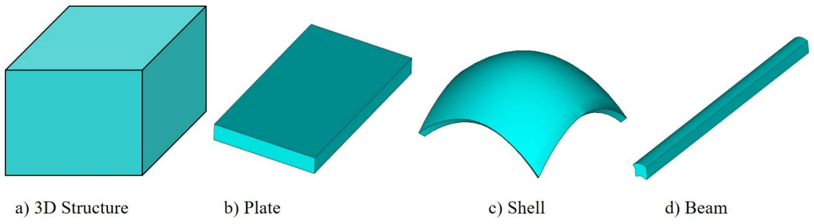
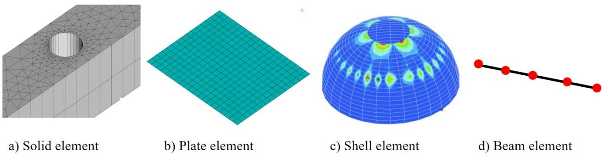

# Structures and Structural Models

To understand the meaning of SG, we need to define what is a structure. Structure and material often appear together and sometimes are used interchangeably. The main reason is that the difference between structure and material is not clear. The interchangeable use of these two terms starts from the first solid mechanics course, usually called either Strength of Materials or Mechanics of Materials, mainly covering stress analysis of various structures including rods, shafts, columns, beams, pressure vessels, etc. With the extensive penetration of composites in industry and the increasing capabilities of fabricating materials with complex microstructures, the difference between structure and material becomes even more elusive. 

One possible difference is the presence of boundary: the material itself has no boundaries, but rather may be considered as a point in a structure according to the continuum hypothesis. Another difference is that we describe a material using material properties such as Young’s moduli, Poisson’s ratios, coefficients of thermal expansion (CTEs), yielding limits, ultimate strengths, etc. These properties are intrinsic to the material, and will not change for different structures made of the same material. For example, if a linear elastic material has Young’s modulus equal to 73 GPa, it will always remain this value no matter whether it is used to make a shaft or a pressure vessel, subject to a force of 10 N or 10 kN. It is noted that for nonlinear behavior, the material properties could depend on the current stress or strain state which the material is experiencing but these properties are genetic (or intrinsic) to the material which means even if the material is not experiencing any stress or strain right now, the same constitutive relations exist. 

On the other hand, a structure is a solid body made of one or more materials with clearly defined interactions with its external environment through boundary conditions, applied loads, temperature, moisture, etc. The behavior of a structure is usually described using displacements, strains, stresses, natural frequencies, buckling loads, failure, etc. Structures can be categorized in terms of their external geometry. If the three dimensions of a structure are of similar size, it is called a 3D structure (Figure 1 a). If one dimension of the structure is much smaller than the two other dimensions, the structure is called as a plate (Figure 1 b) or shell (Figure 1 c) depending on whether it is flat or curved along the two large dimensions. Usually the small dimension is called thickness and the two large dimensions are called the in-plane directions. A reference surface can be defined for a plate or shell using the two in-plane coordinates. If one dimension of the structure is much larger than two other dimensions, the structure is called as a beam (Figure 1 d). Usually the large dimension is called the length, span, or axis of the beam and a reference line can be defined for a beam using the axial coordinate. The reference line can be as general as a spatial curve which is the case for initially curved and twisted beams. The two small dimensions are commonly called the cross-section for typical beam-like structures. As far as the mathematical modeling is concerned, this classification only considers the external geometry and the internal construction of these structures can be arbitrary. For example, a porous material with holes in the body can be modeled as a 3D solid, a sandwich flat panel with a honeycomb core can be modeled as a plate, a high aspect ratio wing of aircraft can be modeled as a beam with no clearly defined cross-sections. In this sense, all engineering structural systems, despite its complexity, can be considered as formed by using a combination of structural components in terms of 3D structures, plates/shells, and/or beams as shown in Figure 1 with possible complex internal constructions. 

:::{figure-md}


Typical structural components.
:::


How to predict displacements, strains, and stresses within structures using mathematical models belongs to the long standing branch of applied mechanics call structural mechanics. Although there are historical and practical reasons for classifying structures as 3D structures, plates/shells, and beams, different names for different structures have also motivated us to construct different mathematical models for modeling different structures. Let us use $x _ { 1 } , x _ { 2 } , x _ { 3 }$ to denote the global Cartesian coordinate system. Beams, plates, and shells are also collectively called dimensionally reducible structures because it is possible for us to eliminate the small dimension(s) to create dimensionally reduced models (1D or 2D models) for these structures [6]. More specifically, we can create one-dimensional (1D) models (also called beam models) for beam-like structures. The field variables of beam models are functions of a single coordinate $x _ { 1 }$ describing the beam reference line. We can also create two-dimensional (2D) models (also called plate/shell models) for plate/shell-like structures. The field variables of plate/shell models are functions of $x _ { 1 }$ and $x _ { 2 }$ , the two in-plane coordinates describing the plate/shell reference surface. Here, the notation of 1D, 2D, or 3D refers to the number of coordinates needed to describe the analysis domain. It does not correspond to the dimensionality of the behavior. For example, a 1D beam model can describe the displacements and the rotations of the structure in three directions in space. 

Each model contains three sets of equations including kinematics, kinetics, and constitutive relations, among which only the constitutive relations change for different materials used to make the structure. For composites, the stiffness matrix could be fully populated. The task to compute the constitutive relations is called constitutive modeling. 3D properties (e.g. Young’s moduli, Poisson’s ratios, and shear moduli, etc.) could be obtained either experimentally or through a micromechanics calculation. For isotropic homogeneous structures, 3D material properties are direct inputs for structural analysis using a 3D solid model, and these properties combined with geometric characteristics of the structure can be used for a structural analysis using plate/shell/beam models with the structural stiffness (e.g. $E A , E I , G J$ , etc.) obtained based on apriori assumptions such as the Euler-Bernoulli assumptions for beams. However, such straightforwardness does not exist for structures featuring anisotropy and/or heterogeneity. Many refined assumptions, such as higher-order assumptions, zigzag assumptions, layerwise assumptions, have been introduced to better capture the kinematics along the smaller dimensions of the structure (the thickness of a plate/shell or the cross-section of a beam) in most other approaches. 

Structural analyses are routinely carried out using finite element analysis (FEA) codes such as Abaqus, Ansys, and Nastran in terms of 3D solid elements, 2D plate or shell elements, or 1D beam elements (see Figure 2). Each element type is governed by a corresponding structural model which contains kinematics, kinetics, and constitutive relations. The commonly used engineering beam models include the Euler-Bernoulli model and the Timoshenko model. The Euler-Bernoulli model is also commonly called the classical beam model. The commonly used engineering plate/shell models are the Kirchhoff-Love model and the Reissner-Mindlin model. The Kirchhoff-Love model is also commonly called the classical plate/shell model and the Reissner-Mindlin model is also commonly called the first-order shear-deformation plate/shell model. The commonly used engineering 3D model is the Cauchy continuum model which is also commonly called the classical continuum model. Here, we will restrict ourselves to structures made of linear elastic materials to illustrate the basics of each structural model although it is emphasized that MSG has no such restriction. The models for structures featuring geometrical and material nonlinearities can be found in relevant MSG publications. 

:::{figure-md}


Typical structural elements.
:::


```{toctree}
:maxdepth: 3

cauchy-continuum-model
kirchhoff-love-plate-shell-model
reissner-mindlin-plate-shell-model
euler-bernoulli-beam-model
timoshenko-beam-model
```
